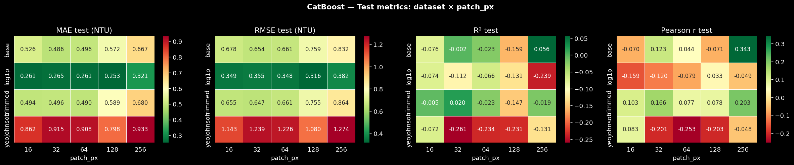
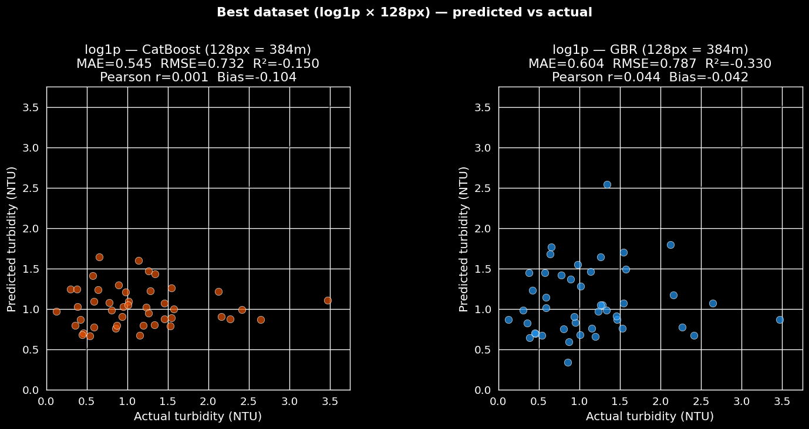
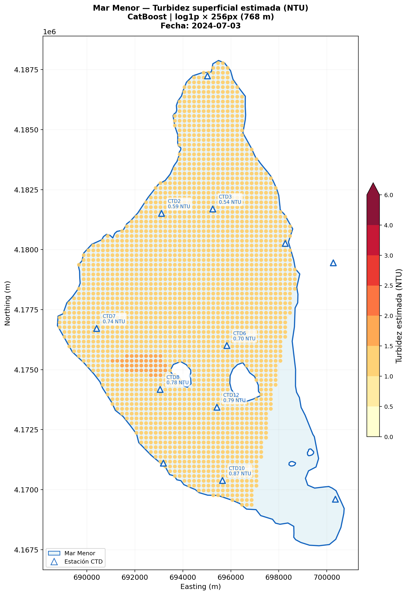

# Surface Turbidity Estimation in the Mar Menor Lagoon

Estimating surface water turbidity in the **Mar Menor** coastal lagoon (Region of
Murcia, Spain) from **Planet SuperDove** multispectral imagery, calibrated against
**CTD in-situ** measurements. The repository contains the full machine-learning
pipeline, from data matching to a spatial turbidity map.

## Data

- **Satellite** — Planet SuperDove scenes (8 spectral bands, 443–865 nm) over the lagoon.
- **In-situ** — UPCT CTD network: surface turbidity (sampled at 0.5 m) from 11 stations.
- **Matched dataset** — 341 CTD ↔ satellite samples across 31 acquisition dates (2023–2024).

## Method

- **Targets** — four variants of the turbidity target are compared: `base` (NTU), `log1p`,
  Yeo-Johnson (`yeojohnson`) and `trimmed` (1–99 % quantiles).
- **Features** — circular image patches are extracted at five scales
  (16 / 32 / 64 / 128 / 256 px ≈ 48–768 m diameter); per-band statistics and spectral
  indices (NDTI, NDWI, NDCI, …) give ~32 features per sample.
- **Selection** — dimensionality-reduction benchmark (PCA, Kernel PCA, UMAP,
  autoencoder, RFECV) with `GroupKFold` to avoid station/date leakage.
- **Models** — Gradient Boosting (HistGB) and CatBoost tuned with Optuna over the
  4 targets × 5 patch scales (40 runs), plus advanced methods (XGBoost, LightGBM,
  stacking).

## Results

CatBoost outperforms Gradient Boosting in **every** target/scale combination. The best
configuration by hold-out error is **`log1p` · 64 px (192 m) · CatBoost**, while the
highest hold-out R² is obtained on the raw `base` target at 256 px (768 m).

| Target | Best model | Patch (px / m) | Test MAE | Test R² |
|---|---|---|---|---|
| `base` (NTU) | CatBoost | 256 / 768 | 0.479 (NTU) | **0.15** |
| `log1p` | CatBoost | 64 / 192 | **0.253** (log1p) | −0.09 |
| `trimmed` (NTU) | CatBoost | 256 / 768 | 0.510 (NTU) | 0.11 |
| `yeojohnson` | CatBoost | 128 / 384 | 0.792 (YJ) | −0.10 |

> **Interpretation.** MAE is expressed in each target's own units, so it is only
> comparable *within* a row; R² (unitless) is comparable across rows. The R² values are
> low — near or below zero on several configurations — which reflects the difficulty of
> the task: a narrow turbidity range and a small temporally-matched hold-out set (tens of
> samples). The predicted maps should therefore be read as indicative spatial patterns
> rather than precise point retrievals.

**Model comparison across scales (CatBoost):**



**Best model — predicted vs. observed (hold-out):**



**Predicted surface turbidity over the lagoon:**



## Pipeline (run the notebooks in order)

| Notebook | Purpose |
|---|---|
| `00_date_clustering` | Acquisition-date planning (turbidity regimes, coverage gaps) |
| `01_data_exploration` | CTD ↔ satellite matching and EDA |
| `02_data_preprocessing` | Build the four target-variable datasets |
| `03_satellite_imagery_processing` | Multi-scale circular patch extraction, band statistics |
| `04_feature_engineering` | Band statistics + spectral indices |
| `05_dimensionality_reduction` | Reduction / feature-selection benchmark |
| `05_model_training` | GBR + CatBoost training and tuning (Optuna) |
| `05b_advanced_methods` | XGBoost, LightGBM, stacking |
| `06_model_evaluation` | Metrics, heatmaps, overfitting diagnosis, residuals |
| `07_predictions_and_mapping` | Grid inference and turbidity maps (GeoTIFF) |

## Project layout

```
code/         the 10 pipeline notebooks
data/
  raw/UPCT/   raw CTD measurements
  datasets/   matched and preprocessed datasets
geospatial/   lagoon polygon, CTD points, QGIS project
results/      metrics (CSV), figures, trained models, GeoTIFF rasters
```

## Setup & run (uv)

This project uses [uv](https://docs.astral.sh/uv/) for environment and dependency
management. From the project root:

```bash
uv sync                # create .venv and install everything (writes uv.lock)
uv run jupyter lab     # open the notebooks in the project environment
```

Then run the notebooks in the numerical order shown above.

Notes:
- Python 3.10–3.12 is supported (prebuilt wheels for PyTorch, CatBoost, rasterio, etc.).
- PyTorch installs the CPU build by default; uncomment the CUDA index block in
  `pyproject.toml` and re-run `uv sync` to use GPU wheels.
- No system GDAL is required — `rasterio`, `geopandas` and `shapely` ship binary wheels.

## Code & reproducibility

Full source code: <https://github.com/adricanovas/turbidity_satellite_estimation>

- **Environment** — dependencies are pinned with uv (`pyproject.toml` + `uv.lock`), so
  `uv sync` recreates the exact same environment on Python 3.10–3.12.
- **Determinism** — train/test splits, cross-validation folds and the models use fixed
  random seeds (`random_state = 42`), so re-running the notebooks reproduces the reported
  metrics.
- **Version-controlled artefacts** — the matched CTD ↔ satellite dataset, the
  per-configuration metrics (`results/model_metrics.csv`), per-sample predictions and the
  evaluation figures are tracked in the repository.
- **Not redistributed** — Planet SuperDove imagery (`data/satellite/`) is excluded under
  Planet's licence, together with the trained model binaries (`results/models/`) and the
  intermediate patch/processed caches (see `.gitignore`). Reproducing the
  imagery-processing stage (`03_satellite_imagery_processing`) therefore requires your own
  Planet access; the downstream stages run from the tracked data.

To reproduce from scratch:

```bash
git clone https://github.com/adricanovas/turbidity_satellite_estimation.git
cd turbidity_satellite_estimation
uv sync
uv run jupyter lab      # run notebooks 00 -> 07 in order
```
